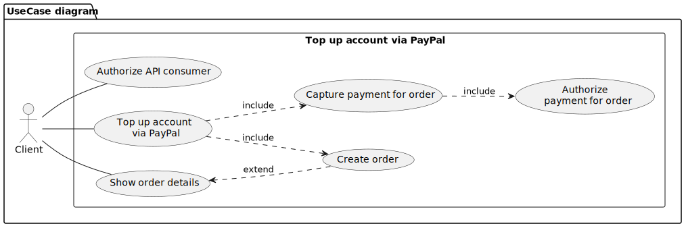
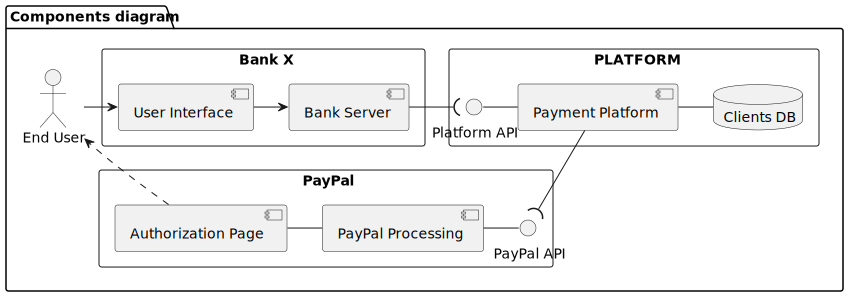
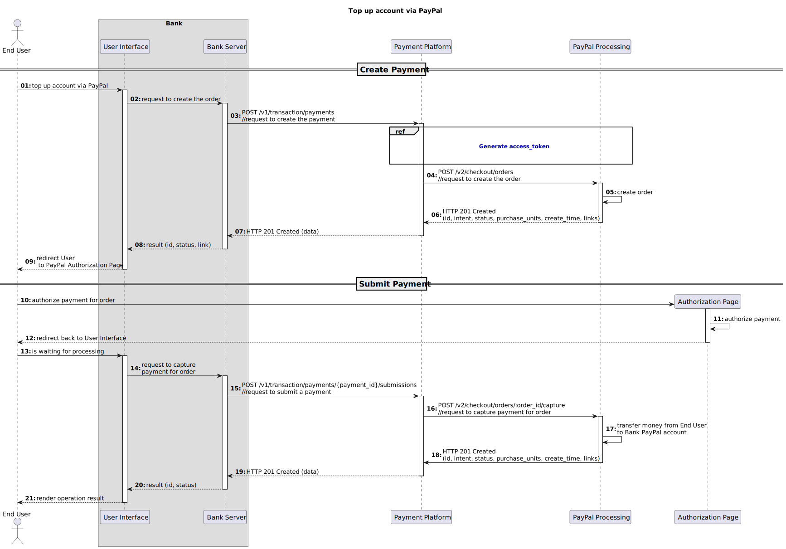
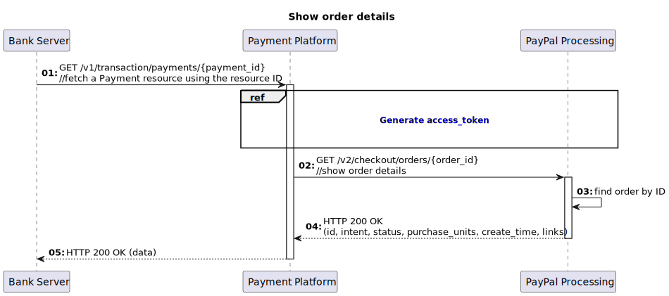

# Introduction
This document outlines the business, stakeholder, and solution requirements, as well as the assumptions and risks, for the account funding via PayPal feature.  
It is intended for product managers, developers, quality assurance specialists, and other stakeholders.  
The text contains many technical terms, which are defined in the Glossary section for further clarity. You can refer to the [Glossary](./glossary.md) for detailed explanations of these terms. 

# Objective and solution concept
This section describes business requirements, success metrics and assumptions.
## Context
Bank X, our customer, aims to increase monthly user activity. They have identified that some of their users utilize the PayPal system in both their business and personal lives. As a result, Bank X wants to offer the option for users to fund their bank accounts via PayPal without incurring any commission.
## Business opportunity
Platform can differentiate itself on the market by offering PayPal payment services as a separate product on its Payment Platform, accessible through a single API. This could give Platform a competitive advantage.
## Success metrics
Within six months of implementation, ten percent of Platform customers subscribed to the PayPal service through the Payment Platform.
## Assumptions
- Customers will be interested in using the PayPal service through the Payment Platform.
- The PayPal service will be easy for customers to use and understand.
- Customers will trust the PayPal service and feel confident using it to fund their bank accounts.
- The Payment Platform will be able to handle the additional traffic and workload generated by the PayPal service.
- The PayPal service will be available and reliable during the implementation period.
- The integration of the PayPal service into the Payment Platform will be successful and will not cause any disruptions or issues.
## Limitations
- The System must provide PayPal money transfer service via single Platform API. 

## User Classes and Characteristics
- End Users - these are the individuals who will be using the system to make payments or receive payments through PayPal.
- Bank - this is a business that accepts payments through PayPal.
- Security Specialists - these are the individuals responsible for ensuring the security of a bank's systems and processes.
- Payment Monitoring Specialists - these are the individuals responsible identifying and preventing fraudulent or unauthorized payment transactions, as well as analyzing and reviewing payment trends and patterns to identify potential risks or vulnerabilities.
- Developers - these are the individuals responsible for integrating PayPal into the system.
- Quality assurance specialists - these are the individuals responsible for testing the PayPal integration to ensure that it is working correctly.

# Project Scope

Product Features:

- The client can authorize themselves
- The client can top up account via PayPal:
   - Create order
   - Capture payment for order
     - Authorize payment for order
 - The client can fetch order details
   - Show order details
  
_The client in this case is a Bank that is using the API as a consumer._

# Conceptual Architecture

Systems components:

- Bank
    - User Interface
    - Bank Server 
- Platform
    - Payment Platform
    - Clients DataBase
    - Platform API
- PayPal
    - PayPal Processing
    - Authorization Page
    - PayPal API

# System Features
## Authorize API Consumer
Authorization is the process of determining whether a client or user has the permission to access a specific resource or perform a specific action through an API. This is typically done by verifying that the client or user has the necessary permissions or privileges to access the resource or perform the action.
### Use Cases

||__Authorize API Consumer__|
|---|---|
|**Participants**|Bank Server, Payment Platform, Clients DB, PayPal Processing|
|**Trigger**|Payment Platform accepts PayPal service request|
|**Diagram**||
|**Main Flow**|01: Bank Server sends Request to Payment Platform   02: Payment Platform retrieves the signature from the Authorization header   03: Payment Platform queries Clients DataBase to find Client by using keyId from signature   04: Clients public key returns from Clients DataBase   05: Payment Platform uses the public key to verify the signature   06: Payment Platform queries Clients DataBase to get Clients credentials   07: Clients credentials returns from Clients DataBase   08: Payment Platform sends the request to PayPal Processing to generate access token   09: PayPal Processing checks credentials and generates access token   10: Access token returns to Payment Platform   ...   11: Bank Server gets operation result|    
|**Alternative and Negative Flows**| &mdash; Step 02 of the Main flow : There is no signature in the header => Bank Server gets HTTP 400 Bad Request   &mdash; Step 05 of the Main flow : Signature verification failed => Bank Server gets HTTP 401 Unauthorized|
|**Result**|Client successfully authorized|

### Solution Requirements
|User Story|Requirements|Priority|
|---|---|---|
|As a Bank, I want to secure my PayPal credentials so that only I have access to them.|&mdash; The System must have the capability to store and retrieve client credentials from a secure database.  &mdash; The System must verify the authenticity and integrity of requests for client credentials by checking the request signature before providing access to the credentials.   &mdash; The System must ensure that only authorized users can access and modify client credentials, and that all access to client credentials is properly logged and audited for security and compliance purposes.|High|
|As a Security Specialist, I want to use credentials to secure my access to the system so that only I can create orders.|&mdash; The System must have the ability to invoke the [PayPal authorization service](https://developer.paypal.com/api/rest/authentication/) in order to generate an access token.   &mdash; The System must ensure that the access token is securely stored and managed, and that it is only used for the purposes for which it was granted.|High|

## Top up account via PayPal
Top up a bank account via PayPal service means to transfer funds from a PayPal account to a bank account.  
To top up a bank account via PayPal, the individual or business making the top-up will need to have a PayPal account and sufficient funds available in their account to complete the top-up. 
### Use Cases
||__Top up account via PayPal__|
|---|---|
|**Participants**|End User, User Interface, Bank Server, Payment Platform, PayPal Processing|
|**Trigger**|End User wants to top up account via PayPal|
|**Diagram**||
|**Main Flow**|01: End User enters amount and clicks on the button to top up account via PayPal   02: User Interface sends request to Bank Server to create the order   03: Bank Server sends request to Payment Platform to create the Payment   04: Payment Platform sends request to PayPal Processing to create the order   05: PayPal Processing creates the order   06: PayPal processing returns to Payment Platform HTTP 201 Created code with order identifier, status and link to authorize payment   07: Payment Platform returns to Bank Server HTTP 201 Created code with payment data including order identifier, status and link   08: Bank Server returns to User Interface result with order identifier, status and link  09: User Interface redirects End User to the link to authorize payment   10: End User authorizes payment for the order   11: Authorization Page authorizes payment for the order   12: Authorization Page redirects back End User to the Banks User Interface   13: End User is waiting payment processing   14: User Interface sends request Bank Server to capture payment for order   15: Bank Server sends request to Payment Platform to submit the payment   16: Payment Platform sends request to PayPal Processing to capture payment for order   17: PayPal Ptocessing transfers money from End User account to Bank PayPal account   18: PayPal processing returns to Payment Platform HTTP 201 Created code with order identifier and status   19: Payment Platform returns to Bank Server HTTP 201 Created code with payment data including order identifier and status   20: Bank Server returns result to User Interface   21: User Interface renders operation result to the End User|    
|**Alternative and Negative Flows**| &mdash; Step 04 of the Main flow: Authentication failed due to invalid authentication credentials or a missing Authorization header => PayPal returns HTTP 401 Unauthorized => Payment Platform repeats Generate access token use case and request to PayPal   &mdash; Step 16 of the Main flow: Payer has not yet approved the Order for payment => PayPal returns HTTP 422 Unprocessable Entity => Payment Platform returns to Bank HTTP 422 Unprocessable Entity|
|**Result**|Client successfully topped up account via PayPal|

### Solution Requirements
|User Story|Requirements|Priority|
|---|---|---|
|As an End User, I want to be able to transfer funds from my PayPal account to my bank account so that I can access and use the money in my PayPal account.|&mdash; The System must provide a service for creating payments through PayPal.  &mdash; The System must have the capability to invoke the [PayPal create order service](https://developer.paypal.com/docs/api/orders/v2/#orders_create) in order to initiate a payment through PayPal.|High|
|As an End User, I want to be able to authorize payments in order to ensure that only I can make payments through my PayPal account.| &mdash; The system must provide a link to the PayPal authorization page in order to allow end users to securely authorize the payment.   &mdash; The System must provide a service for submitting payments through PayPal.   &mdash; The System must have the capability to invoke the [PayPal capture payment for order service](https://developer.paypal.com/docs/api/orders/v2/#orders_capture) in order to capture payment for an order|High|

## Show order details
In cases where the system experiences a response timeout or misses transaction data, it must be able to retrieve order details from PayPal in order to ensure the integrity of the financial transactions.

### Use Cases

||__Show Order Details__|
|---|---|
|**Participants**|Bank Server, Payment Platform, PayPal Processing|
|**Trigger**|Bank wants to fetch order details|
|**Diagram**||
|**Main Flow**|01: Bank Server sends request to Payment Platform to fetch a payment resource by using the resource identifier   02: Payment Platform sends to PayPal Processing request to show order details   03: PayPal finds order by identifier   04: PayPal returns to Payment Platform HTTP 200 OK code with order details   05: Payment Platform returns to Bank Server HTTP 200 OK code with order details|    
|**Alternative and Negative Flows**| &mdash; Step 02 of the Main flow : There is no order with requested ID => Bank Server gets HTTP 404 Not Found|
|**Result**|Order details were provided|

## Solution Requirements
|User Story|Requirements|Priority|
|---|---|---|
|As a Payment Monitoring Specialist, I want to be able to track orders in PayPal in order to monitor and manage financial transactions.|&mdash; The System must provide a service for fetching payment details through PayPal.   &mdash; The System must have the capability to invoke the [PayPal show order details service](https://developer.paypal.com/docs/api/orders/v2/#orders_get) in order to get order details|Medium|